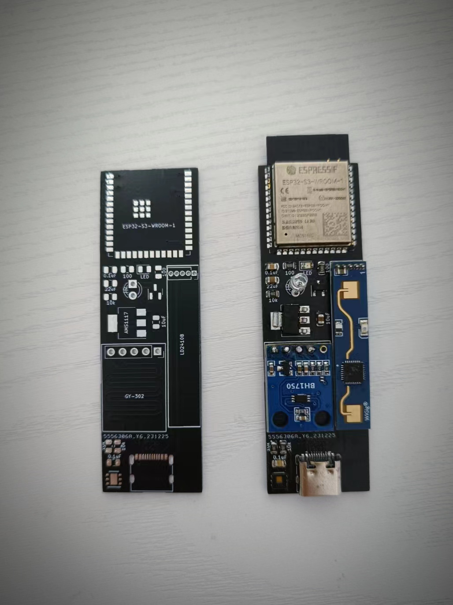

基于 ESP32 的家庭智能传感器，搭配 [Home Assistant](https://www.home-assistant.io/) 项目实现家自动化。

小巧的身材上集成温湿度 / 光照度 / 人体存在传感器和红外发射管。

## 硬件设计
* 主控选用 ESP32-S3-WROOM-1
* 温湿度传感器选用 HDC1080
* 光照度传感器选用 GY-302 模块
* 人体存在传感器选用 LD2410B 模块
* 红外发射选用 3mm 发射管
* 状态灯选用贴片发光二极管
* 采用 typec 口供电 / 烧写程序，针脚对应关系：

    | typec | esp32 | 备注 |
    |---|---|---|
    | GND (A1, A12, B1, B12) | GND | 接地 |
    | VBUS (A4, A9, B4, B9) | | 5V |
    | CC1 (A5), CC2 (B5) | GPIO0 | 烧写固件时需接地 |
    | D+ (A6, B6) | GPIO43 | TX |
    | D- (A7, B7) | GPIO44 | RX |

## 电路设计
原理图及 PCB 采用 kicad 绘制，项目文件见 circut 目录（依赖 [ESPRESSIF 官方库](https://github.com/espressif/kicad-libraries)）。

* 所有贴片元件均采用 0805 封装尺寸
* 红外管引脚可多留一些，以调整发射方向
* 不需要的传感器可留空
* 由于不同颜色发光二极管的压降不同，在 R3 为 100 欧姆时 D2 采用红色发光二极管效果较好，采用黄色发光二极管时亮度较低。若要使用其他颜色发光二极管可自行计算 R3 阻值。

## 固件设计
固件使用 [ESPHome](https://esphome.io/) 搭建，配置文件见 esphome 目录。

* 暴露以下传感器至 Home Assistant:
    * 一个温度传感器
    * 一个湿度传感器
    * 一个光照度传感器
    * 一个人体存在二元传感器
    * 一个人体存在距离传感器
    * 一个可开关的 LED 灯（复用状态灯）
* 项目中对红外管的使用比较客制化，使用自定义的 MQTT 消息驱动。建议改用 [Remote Transmitter](https://esphome.io/components/remote_transmitter.html) 或自行修改。

## 应用参考
接入 Home Assistant 后，可使用暴露出的传感器实现一些家庭自动化，例如：
* 使用人体存在传感器配合光照度传感器控制灯
* 甚至可配合人体存在距离传感器大致确定人体位置后控制不同的灯
* 使用人体存在传感器配合温度传感器控制空调制冷 / 加热 / 关闭
* 使用湿度传感器控制加湿器
* 使用 LED 指示报警信息（电量低，扫地机集尘盒满等）
* 使用红外管控制空调 / 电视 / 浴霸等传统电器
* ……

## 捐赠
如果此项目对你有帮助，可扫描下方二维码请我喝杯咖啡 :)

&nbsp;&nbsp;&nbsp;&nbsp;&nbsp;&nbsp;&nbsp;&nbsp;  &nbsp;&nbsp;&nbsp;&nbsp;&nbsp;&nbsp;&nbsp;&nbsp;&nbsp;&nbsp;&nbsp;&nbsp;&nbsp;&nbsp;&nbsp;&nbsp; 
